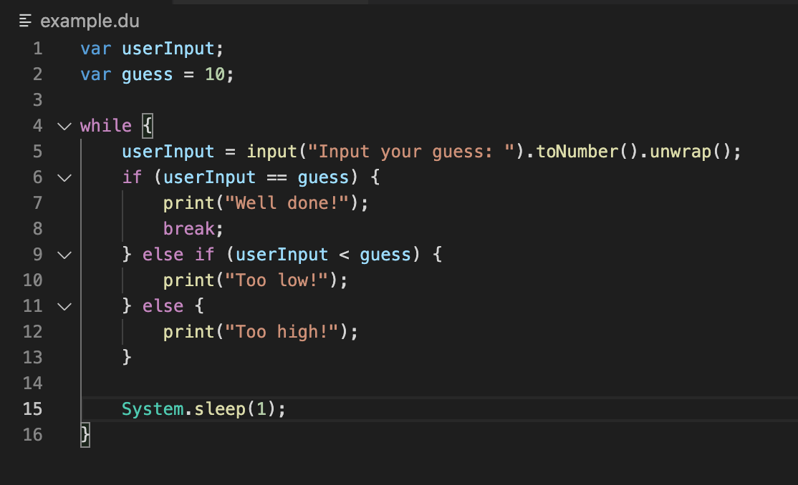
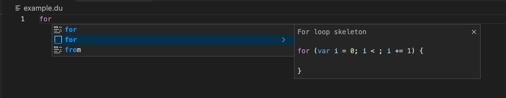
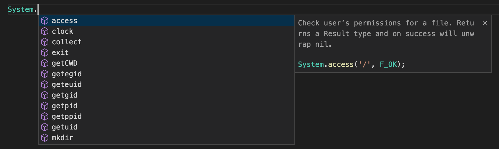

# Dictu Extension

The [Dictu language](https://dictu-lang.com) extension for [VSCode.](https://code.visualstudio.com/)

## Functionality

- Syntax highlighting
- Auto completion

More planned.

### Syntax highlighting

 
<em>(Syntax highlighting)</em>

### Auto Completion

 
<em>(Auto Completion)</em>

### Documentation

 
<em>(Documentation)</em>

## Contributing

See [contributing](contributing.md).

## License

This project is licensed under the MIT license.
